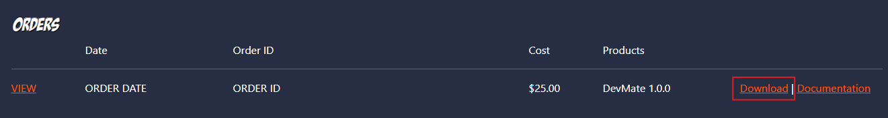
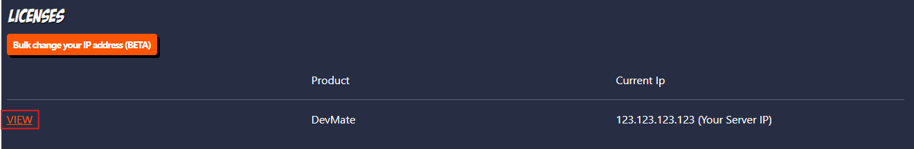
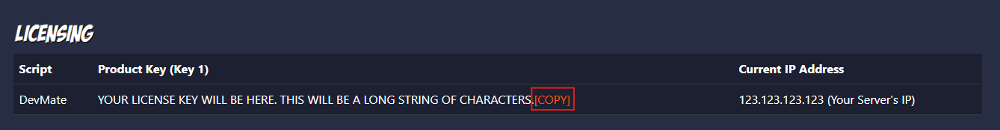

## Overview

This guide will walk you through the complete installation process for DevMate, from downloading the resource to configuring permissions and activating your license.

---

<Callout type="warning" title="Prerequisite">
This guide assumes you have already purchased DevMate from Big Daddy Scripts. If you have not, please [purchase it here](https://bigdaddyscripts.com/Products/View/2586/DevMate).
</Callout>

## Step 1: Download DevMate

After purchasing DevMate, head to your [Big Daddy Scripts Account Page](https://bigdaddyscripts.com/Account) and find the order that contains DevMate. Click on the "Download"
button to download the latest version of DevMate.



---

## Step 2: Extract the File

The `.zip` file you downloaded will contain a folder named `DevMate`. Drag and drop this folder into your `resources` folder.

<Callout type="warning" title="Important">
	**DO NOT** rename the folder. This will result in DevMate not working correctly.
</Callout>

---

## Step 3: Add the Resource to Server

Navigate to your server's `server.cfg` file and add the following line where you want DevMate to start:

```bash title="server.cfg"
ensure DevMate
```

<Callout type="info">It's recommended to place DevMate near the top of your server.cfg to ensure it loads early, but this is not required.</Callout>

---

## Step 4: Grant Permissions

Navigate to your server's `server.cfg` file and add the following line to grant DevMate the necessary permissions:

```bash title="server.cfg"
add_ace resource.DevMate command allow # DevMate Permissions
```

This permission allows DevMate to execute commands required for its functionality.

---

## Step 5: Insert License Key

From the [Big Daddy Scripts Account Page](https://bigdaddyscripts.com/Account), under "Licenses", find DevMate and click on "VIEW".



At the top of the page, you will find your license key. Click the "COPY" button to copy your license key.



Then, navigate to your DevMate configuration file (`DevMate/config.json`) and insert your license key into the `LicenseKey` field:

```json title="DevMate/config.json"
{
	"$schema": "...",
	"LicenseKey": "your-license-key-here",
	...
}
```

<Callout type="warning">Make sure to keep your license key secure and never share it publicly. Your license is tied to your account and server.</Callout>

### License Key Troubleshooting

<Accordions type="single" orientation="vertical">
	<Accordion title='"License key is not set. Please set the license key in the config.json file."'>
		This error indicates that the license key is not set in the config.json file. Please check the config.json file and make sure the license key is set correctly.
	</Accordion>
	<Accordion title='"Improper resource name for DevMate. Expected: DevMate, Received: ..."'>
		This error indicates that the resource name was changed from it's original "DevMate" name. Please rename the resource to "DevMate" and try again. The resource name is crucial for DevMate to work correctly.
	</Accordion>
	<Accordion title='"Failed to connect to the license server. Please check your internet connection"'>
		This error indicates a connection issue between your server and the license server. Check your server's internet connection and try again.

		If this issue persists, please open a [support ticket with Big Daddy Scripts](https://bigdaddyscripts.com/support/tickets).
	</Accordion>
	<Accordion title='"Unknown error occurred while checking your script license"'>
		This is a rare error that occurs when DevMate runs into an unhandled error. If you encounter this error, please open a [support ticket in our Discord](https://discord.gg/NuPCpBa4Vy), and upload a copy of your server logs.
	</Accordion>
</Accordions>

---

## Step 6: Configure Permissions (Optional)

Before starting your server, you may want to configure the permissions system in DevMate. See the [Configuration](/docs/fivem-scripts/devmate/config) guide for detailed information
on setting up role-based permissions.

<Callout type="info">By default, DevMate will work without additional permission configuration, but setting up proper permissions is highly recommended for security.</Callout>

---

## Done

You have now successfully installed DevMate! Start your server and DevMate will be available for use.

<Callout type="success" title="Next Steps">
	- Review the [Configuration](/docs/fivem-scripts/devmate/config) guide to set up permissions and customize DevMate - Check out the
	[Commands](/docs/fivem-scripts/devmate/commands) reference to learn what commands are available - Explore the [Exports](/docs/fivem-scripts/devmate/exports) API if you want to
	integrate DevMate into your scripts
</Callout>

